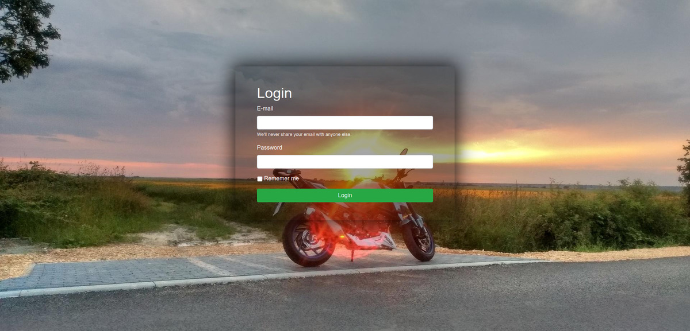

# Login Page
> This is a simple login page based on Bootstrap 4 and some my modifications.

## Table of contents
* [General info](#general-info)
* [Screenshots](#screenshots)
* [Technologies](#technologies)
* [Setup](#setup)
* [Status](#status)
* [Contact](#contact)

## General info
All you need is change the background image and text. Everything works perfect with bootstrap. Page is fully responsive. 

## Screenshots

## Technologies
* HTML
* Bootstrap 4

## Setup
Edit index.html file and change what you want. Page is based on Bootstrap 4, so remember about integrating Bootstrap css nad js in your file. Don't forget to copy global.css file from css directory and bg.jpg file fromimages directory.

## Status
Project is: _finished_

## Contact
Created by Chris [@texe](https://www.texe.varlock.net/) - feel free to contact me!